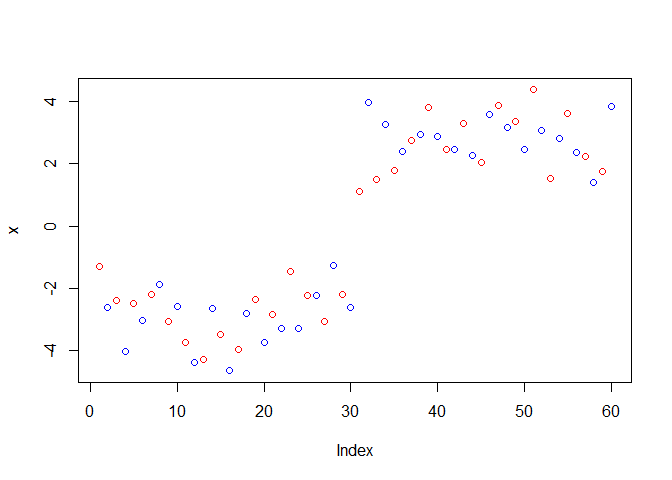

# class07
Diana

Today we are going to learn how to apply dif machine learning methods,
Clustering:

Goal: find groups/clusters in your input data.

Make up some data with clear groups, for clustering. For this we use
‘rnorm()’ function

``` r
tmp<- c(rnorm(30,-3),rnorm(30,3))
x<- cbind(x=tmp, y=rev(tmp))
plot (x)
```


``` r
km <- kmeans(x,centers =4)
km
```

    K-means clustering with 4 clusters of sizes 7, 11, 12, 30

    Cluster means:
              x         y
    1 -3.095543  1.687913
    2 -1.834725  3.321075
    3 -3.717716  3.681039
    4  3.083989 -2.882112

    Clustering vector:
     [1] 3 1 3 3 2 3 3 1 2 3 2 1 2 3 3 3 3 1 2 2 3 3 2 1 2 1 2 1 2 2 4 4 4 4 4 4 4 4
    [39] 4 4 4 4 4 4 4 4 4 4 4 4 4 4 4 4 4 4 4 4 4 4

    Within cluster sum of squares by cluster:
    [1] 12.558050 11.694121  6.281263 69.837459
     (between_SS / total_SS =  91.7 %)

    Available components:

    [1] "cluster"      "centers"      "totss"        "withinss"     "tot.withinss"
    [6] "betweenss"    "size"         "iter"         "ifault"      

``` r
k<-kmeans(x, centers = 2, nstart = 20)
k
```

    K-means clustering with 2 clusters of sizes 30, 30

    Cluster means:
              x         y
    1 -2.882112  3.083989
    2  3.083989 -2.882112

    Clustering vector:
     [1] 1 1 1 1 1 1 1 1 1 1 1 1 1 1 1 1 1 1 1 1 1 1 1 1 1 1 1 1 1 1 2 2 2 2 2 2 2 2
    [39] 2 2 2 2 2 2 2 2 2 2 2 2 2 2 2 2 2 2 2 2 2 2

    Within cluster sum of squares by cluster:
    [1] 69.83746 69.83746
     (between_SS / total_SS =  88.4 %)

    Available components:

    [1] "cluster"      "centers"      "totss"        "withinss"     "tot.withinss"
    [6] "betweenss"    "size"         "iter"         "ifault"      

> Q. How many points are in each cluster?

``` r
k$size
```

    [1] 30 30

> Q. How do we go to the cluster membership/assingment?

``` r
k$cluster
```

     [1] 1 1 1 1 1 1 1 1 1 1 1 1 1 1 1 1 1 1 1 1 1 1 1 1 1 1 1 1 1 1 2 2 2 2 2 2 2 2
    [39] 2 2 2 2 2 2 2 2 2 2 2 2 2 2 2 2 2 2 2 2 2 2

> Q. What ‘component’ of your result object details - cluster sixe? -
> cluster assignment/membership? - cluster center?

``` r
k$centers
```

              x         y
    1 -2.882112  3.083989
    2  3.083989 -2.882112

Plot x colored by the kmeans cluster assignment and add cluster centers
as blue points

``` r
plot(x, col =k$cluster)
points (k$centers, col ="blue", pch=15)
```


``` r
rnorm(10)
```

     [1]  0.1319632 -0.7945350 -1.2161300  1.5932063 -0.5596597  0.2612620
     [7]  1.1630343  0.2150653 -1.1828245  2.4043429

``` r
hist( rnorm(30, mean=3))
```


``` r
n<-30
x<-c(rnorm(n,-3), rnorm(n,+3))
#to get the y axis we reverse x with 'x'
y<-rev(x)
hist(x)
```


R will re-cycle the shorter color vector to be the same lenght as the
longer (number of data points) in x \>Plot x colored by the kmeans
cluster assignment and add cluster centers as blue points

``` r
plot(x, col=c("red", "blue"))
```



``` r
plot(x, col=km$cluster)
points(km$centers, col="blue",pch=15,cex=3)
```


> Q. can you run kmeans and ask for 4 clusters and plot the results like
> we have done above?

``` r
km4 <- kmeans(x, centers = 4)
plot(x, col=km4$cluster)
points(km4$centers, col="blue",pch=15,cex=1.5)
```


\##Hierarchical Cluster Let’s take our made up data ‘x’ and see how
hclust works.

First we need a distance matrix of our data to be clustered

``` r
d<-dist(x)
hc<-hclust(d)
hc
```


    Call:
    hclust(d = d)

    Cluster method   : complete 
    Distance         : euclidean 
    Number of objects: 60 

``` r
plot(hc)
abline(h=8, col="red")
```


I can get my cluster membershop vector by “cutting the tree” with the
‘cutree()’ fucntion:

``` r
grps <- cutree(hc, h=8)
grps
```

     [1] 1 1 1 1 1 1 1 1 1 1 1 1 1 1 1 1 1 1 1 1 1 1 1 1 1 1 1 1 1 1 2 2 2 2 2 2 2 2
    [39] 2 2 2 2 2 2 2 2 2 2 2 2 2 2 2 2 2 2 2 2 2 2

Can yo upot ‘x’ colored by our hclust results:

``` r
plot(x, col=grps)
```


## PCA of UK food data

Read data from the UK on food consumption in dif pats of the UK

> Q1. How many rows and columns are in your new data frame named x? 6
> rows \| 1-4 of 4 columns What R functions could you use to answer this
> questions?

``` r
url <- "https://tinyurl.com/UK-foods"
x <- read.csv(url, row.names = 1)
head(x, )
```

                   England Wales Scotland N.Ireland
    Cheese             105   103      103        66
    Carcass_meat       245   227      242       267
    Other_meat         685   803      750       586
    Fish               147   160      122        93
    Fats_and_oils      193   235      184       209
    Sugars             156   175      147       139

> Q2. Which approach to solving the ‘row-names problem’ mentioned above
> do you prefer and why? Is one approach more robust than another under
> certain circumstances?

> Q3: Changing what optional argument in the above barplot() function
> results in the following plot? barside

``` r
cols <- rainbow(nrow(x))
barplot(as.matrix(x), col=cols)
```


``` r
#with 'beside=T'
barplot(as.matrix(x), beside=T, col=rainbow(nrow(x)))
```


> Q5: Generating all pairwise plots may help somewhat. Can you make
> sense of the following code and resulting figure? What does it mean if
> a given point lies on the diagonal for a given plot?

“Pairs” plot can be useful for small datasets like this one:

``` r
pairs(x, col=rainbow(10), pch=16)
```


It is hard to see structure and trends in even this small dta-set. How
will we ever do this when we have big datasets with bigger data. \>Q6.
What is the main differences between N. Ireland and the other countries
of the UK in terms of this data-set? the plot is more scattered

\###PCA to the rescue (for bigger data)

’prcomp()’this is the main function in base R to do PCA

``` r
pcs <- prcomp(t(x))
#stats summary from dataset
summary(pcs)
```

    Importance of components:
                                PC1      PC2      PC3       PC4
    Standard deviation     324.1502 212.7478 73.87622 3.176e-14
    Proportion of Variance   0.6744   0.2905  0.03503 0.000e+00
    Cumulative Proportion    0.6744   0.9650  1.00000 1.000e+00

inside ‘PCA’ object that we created from running ‘prcomp()’

``` r
attributes(pcs)
```

    $names
    [1] "sdev"     "rotation" "center"   "scale"    "x"       

    $class
    [1] "prcomp"

``` r
pcs$x
```

                     PC1         PC2        PC3           PC4
    England   -144.99315   -2.532999 105.768945 -4.894696e-14
    Wales     -240.52915 -224.646925 -56.475555  5.700024e-13
    Scotland   -91.86934  286.081786 -44.415495 -7.460785e-13
    N.Ireland  477.39164  -58.901862  -4.877895  2.321303e-13

> Q7. Complete the code below to generate a plot of PC1 vs PC2. The
> second line adds text labels over the data points.

``` r
plot(pcs$x[,1], pcs$x[,2],  xlab="PC1", ylab="PC2", xlim=c(-270,500))
text(pcs$x[,1], pcs$x[,2], colnames(x))
```


> 8.  Customize your plot so that the colors of the country names match
>     the colors in our UK and Ireland map and table at start of this
>     document.

``` r
country_cols <-c("orange", "red", "blue", "green")
plot(pcs$x[,1], pcs$x[,2], xlab="PC1", ylab="PC2",
     col=c("black", "red", "darkgreen"), pch=16 )
text(pcs$x[,1], pcs$x[,2], colnames(x), col=country_cols)
```


\##Digging deeper

``` r
v <- round( pcs$sdev^2/sum(pcs$sdev^2) * 100 )
v
```

    [1] 67 29  4  0

``` r
x <- summary(pcs)
x$importance
```

                                 PC1       PC2      PC3          PC4
    Standard deviation     324.15019 212.74780 73.87622 3.175833e-14
    Proportion of Variance   0.67444   0.29052  0.03503 0.000000e+00
    Cumulative Proportion    0.67444   0.96497  1.00000 1.000000e+00

``` r
barplot(v, xlab="Principal Component", ylab="Percent Variation")
```


``` r
par(mar=c(10, 3, 0.35, 0))
barplot( pcs$rotation[,1], las=2 )
```


